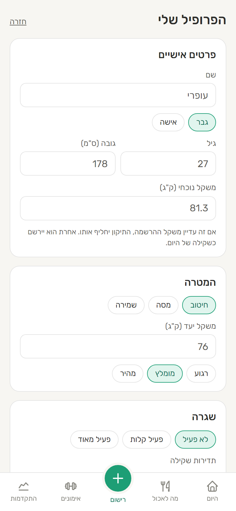
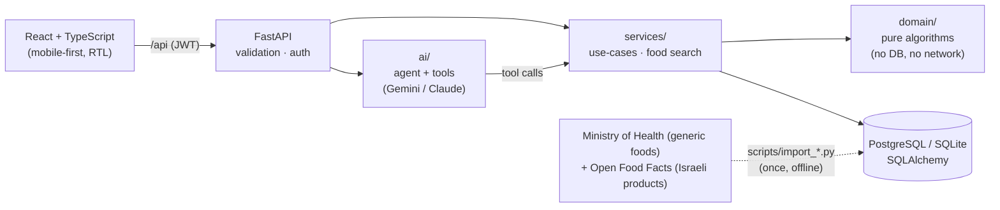

# FitFlow

[](https://github.com/OfriKeidar/FitFlow/actions/workflows/ci.yml)

### 🔗 [Live demo: fitflow-rgtr.onrender.com](https://fitflow-rgtr.onrender.com)
Log in with **`demo@fitflow.app`** / **`demo1234`** (a shared account with 5 weeks of data), or create your own.
*Free hosting: the first visit after a quiet period can take up to a minute while the server wakes up.*

**An adaptive nutrition & training coach.** Tell it what you ate in plain language, and it tracks
calories and macros, **learns your real metabolism from your own data**, and suggests meals from what
you have at home using an optimization algorithm.

A Hebrew, mobile-first web app. The design principle behind it: **deterministic algorithms at the core, AI at the edges.**
The LLM turns free text into calls to tested code. It never makes up a number.

<p align="center">
  
  
  
  
</p>
<p align="center">
  
  
  
  
</p>

## Highlights

| | What | How |
|---|---|---|
| 🧠 | **Adaptive TDEE**: learns how many calories *you* actually burn | Energy balance + least-squares slope of the weight trend, damped and capped; works with daily, weekly or monthly weigh-ins |
| 🍽️ | **"What should I eat?"** from what's at home, plus **"fit my meal"** amounts | **Integer Linear Programming** (PuLP/CBC): pantry limits, sensible-meal constraints, weighted macro deviation; **no-good cuts** for alternative suggestions |
| 💬 | **AI coach**: "I ate 2 eggs and ran for 30 minutes" | Tool-use agent with a hand-written loop; **proposes** entries, and the user **confirms** before anything is saved |
| 🛡️ | **AI safety**: off-topic requests, prompt injection, extreme diets | Defense in depth (least-privilege tools, human in the loop, validation, limits, prompt rules) and **safety evals against the real model**: 9/11 → 11/11 |
| 🔌 | **Any LLM**: Gemini (free), Claude, or any OpenAI-style API | Provider adapters; model fallback and a circuit breaker for free-tier quotas and overloads |
| 📈 | **Weight trend** without the daily water noise | Time-aware EWMA (alpha depends on the gap between weigh-ins) |
| 🎯 | **Target date**: "you'll reach 70 kg around Nov 26" | Pace as a % of body weight (safe for every body size); the bulking pace depends on training experience; switches to maintenance at the target |
| 🥗 | **5,000+ Israeli foods**: generic foods with household units ("1 slice"), plus branded products (Tnuva, Osem...) | The Ministry of Health's national database + Open Food Facts, imported and cleaned by scripts; relevance-ranked search, so "egg" finds a fresh egg, not egg powder |
| 🔍 | **Insights** like "you eat 544 kcal more on weekends" | Statistics with minimum-data and minimum-effect thresholds, so it doesn't report noise |
| 🔐 | **Auth** | scrypt password hashing, stateless JWT, same error for unknown email and wrong password |

## Architecture



- **`domain/`** holds the algorithms as pure functions: energy targets, adaptive TDEE, the ILP optimizer, insights. Most of the tests live here.
- **`services/`** loads data, runs the domain logic and saves the results. `mappers.py` keeps SQLAlchemy out of the domain.
- **`ai/`** is the agent loop, the tool definitions and the prompt. Write tools only create *pending actions*.
- **`api/`** holds the FastAPI routes and Pydantic schemas. **`web.py`** serves the API and the built frontend from one origin.
- **`data/`** ships the food databases as JSON; `db/seed.py` loads them on first start and `db/migrate.py` upgrades existing databases in place.

Design decisions, trade-offs and the bugs found along the way are in **[docs/ARCHITECTURE.md](docs/ARCHITECTURE.md)**.

## Algorithms

The core logic is built on classic algorithms from CS courses:

| Algorithm | Where | The problem it solves in the app |
|---|---|---|
| **Knapsack** (bounded, multi-dimensional) | `domain/optimizer.py` | "What should I eat from what's at home?" Foods are the items, servings are copies (bounded by the pantry), and the 4 macros are 4 "weight" dimensions. The goal is to land closest to the meal's target, not to maximize value |
| **Dynamic programming, 1-D** (the Kadane pattern) | `domain/workout_stats.py` | Longest workout streak in days and in weeks: `run[i] = run[i-1] + 1` if day *i* follows day *i-1*, else `1`; the answer is `max(run)`. O(n) time, O(1) memory |
| **Recurrence / exponential smoothing** (a low-pass filter) | `domain/trend.py` | The weight trend: `trend[i] = trend[i-1] + α·(weight[i] - trend[i-1])`, with α depending on the days between weigh-ins. Filters daily water noise in one pass |
| **Least-squares linear regression** | `domain/trend.py` | The rate of weight change (kg/day), in closed form, O(n) |
| **Hash maps / sets** | `workout_stats.py`, `db/seed.py` | Counting the most frequent activity, and O(1) duplicate checks when loading the food database |

## Stack
**Backend:** Python 3.11, FastAPI, SQLAlchemy 2, PuLP, Gemini (OpenAI-compatible API) / Anthropic SDK, PyJWT, pytest (142 tests)
**Frontend:** React 19, TypeScript, Vite, Recharts, a PWA manifest, dark mode
**Ops:** Docker (multi-stage, non-root), docker-compose with PostgreSQL, GitHub Actions (tests on SQLite *and* PostgreSQL, lint, build, Docker smoke test), Render blueprint

## Run it

```bash
# Backend
python -m venv .venv
.venv/Scripts/pip install -e ".[dev]"
.venv/Scripts/python -m pytest                     # 142 tests
.venv/Scripts/python -m scripts.seed_demo           # optional: demo account with 5 weeks of data
.venv/Scripts/python -m scripts.eval_safety         # optional: AI safety evals against the real model (needs a key)
.venv/Scripts/uvicorn fitflow.api.main:app          # API + interactive docs at http://localhost:8000/docs

# Frontend (second terminal)
cd frontend && npm install && npm run dev           # http://localhost:5173
```

The demo account is `demo@fitflow.app` / `demo1234`.

Or run the whole stack, including PostgreSQL, the way it runs in production:
```bash
docker compose up --build                           # http://localhost:8000
```

The AI coach needs a key in `.env` (copy `.env.example`). A **free Gemini key** from
[Google AI Studio](https://aistudio.google.com) is enough, and `ANTHROPIC_API_KEY` works too. Everything else works
without one, including all the tests (the agent is tested against scripted fake clients).

## Data
Food nutrition values:
- Generic foods: the Israeli national nutrition database (Tzameret), Israel Ministry of Health, via [data.gov.il](https://data.gov.il).
- Branded Israeli products: [Open Food Facts](https://world.openfoodfacts.org), available under the
  [Open Database License](https://opendatacommons.org/licenses/odbl/1-0/). `fitflow/data/foods_off.json` is a
  derived database and is also released under the ODbL.
