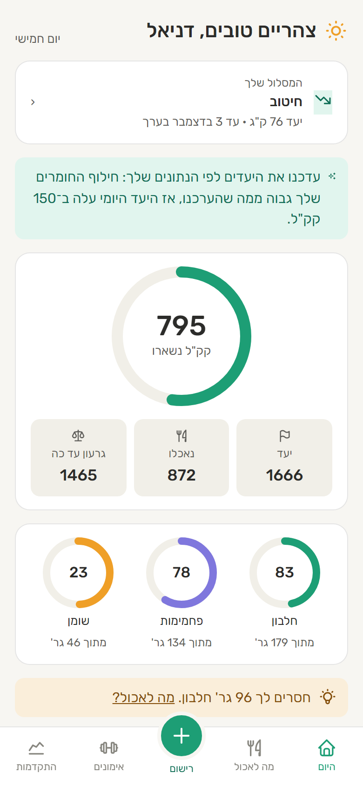
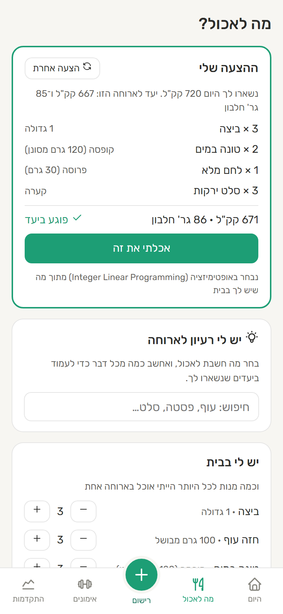
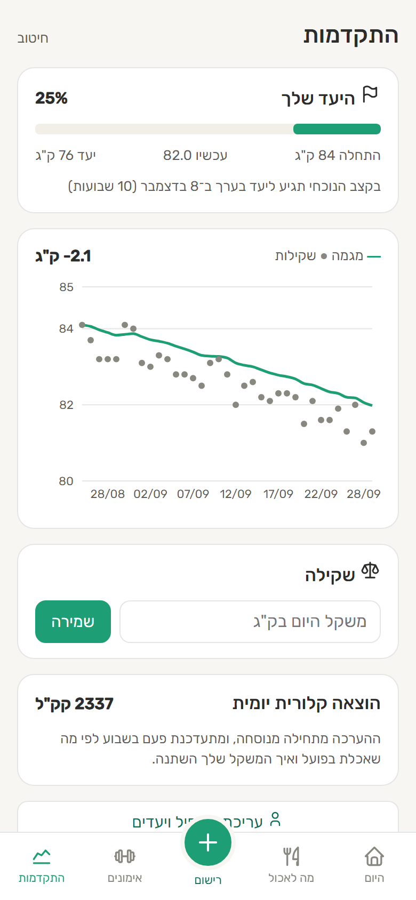
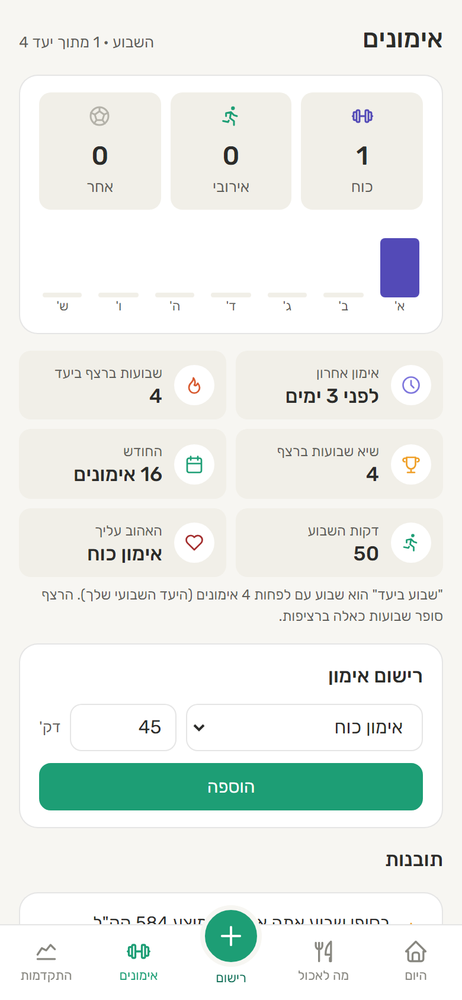
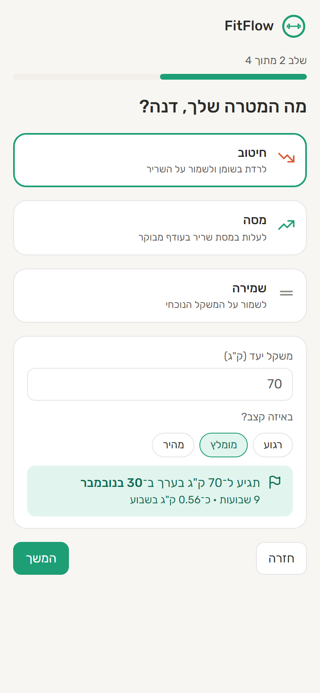
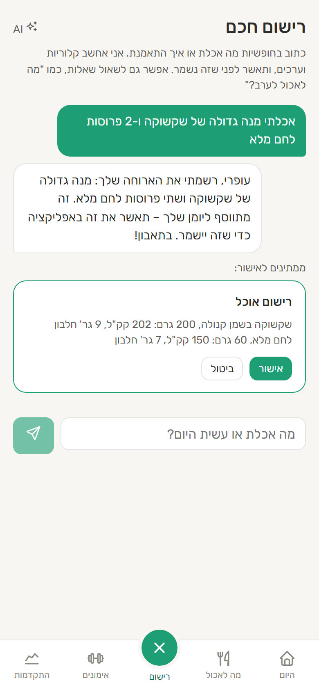
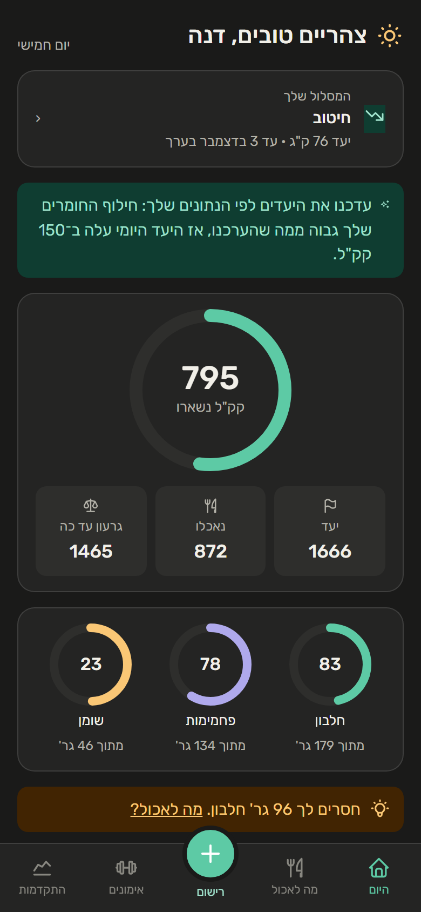
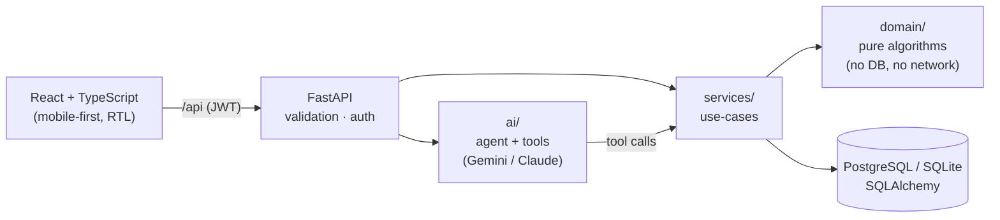

# FitFlow

[](https://github.com/OfriKeidar/FitFlow/actions/workflows/ci.yml)

**An adaptive nutrition & training coach.** Tell it what you ate in plain language, and it tracks
calories and macros, **learns your real metabolism from your own data**, and suggests meals from what
you have at home using an optimization algorithm.

A Hebrew, mobile-first web app. The design principle behind it: **deterministic algorithms at the core, AI at the edges.**
The LLM turns free text into calls to tested code. It never makes up a number.

<p align="center">
  
  
  
  
</p>
<p align="center">
  
  
  
</p>

## Highlights

| | What | How |
|---|---|---|
| 🧠 | **Adaptive TDEE**: learns how many calories *you* actually burn | Energy balance + least-squares slope of the weight trend, damped and capped; works with daily, weekly or monthly weigh-ins |
| 🍽️ | **"What should I eat?"** from what's at home | **Integer Linear Programming** (PuLP/CBC): servings × foods, pantry limits, sensible-meal constraints, weighted macro deviation |
| 💬 | **AI coach**: "I ate 2 eggs and ran for 30 minutes" | Tool-use agent with a hand-written loop; **proposes** entries, and the user **confirms** before anything is saved |
| 🔌 | **Any LLM**: Gemini (free), Claude, or any OpenAI-style API | Provider adapters; model fallback and a circuit breaker for free-tier quotas and overloads |
| 📈 | **Weight trend** without the daily water noise | Time-aware EWMA (alpha depends on the gap between weigh-ins) |
| 🎯 | **Target date**: "you'll reach 70 kg around Nov 26" | Pace as a % of body weight (safe for every body size); switches to maintenance at the target |
| 🔍 | **Insights** like "you eat 544 kcal more on weekends" | Statistics with minimum-data and minimum-effect thresholds, so it doesn't report noise |
| 🔐 | **Auth** | scrypt password hashing, stateless JWT, same error for unknown email and wrong password |

## Architecture



- **`domain/`** holds the algorithms as pure functions: energy targets, adaptive TDEE, the ILP optimizer, insights. Most of the tests live here.
- **`services/`** loads data, runs the domain logic and saves the results. `mappers.py` keeps SQLAlchemy out of the domain.
- **`ai/`** is the agent loop, the tool definitions and the prompt. Write tools only create *pending actions*.
- **`api/`** holds the FastAPI routes and Pydantic schemas. **`web.py`** serves the API and the built frontend from one origin.

Design decisions, trade-offs and the bugs found along the way are in **[docs/ARCHITECTURE.md](docs/ARCHITECTURE.md)**.

## Stack
**Backend:** Python 3.11, FastAPI, SQLAlchemy 2, PuLP, Gemini (OpenAI-compatible API) / Anthropic SDK, PyJWT, pytest (107 tests)
**Frontend:** React 19, TypeScript, Vite, Recharts, a PWA manifest, dark mode
**Ops:** Docker (multi-stage, non-root), docker-compose with PostgreSQL, GitHub Actions (tests on SQLite *and* PostgreSQL, lint, build, Docker smoke test), Render blueprint

## Run it

```bash
# Backend
python -m venv .venv
.venv/Scripts/pip install -e ".[dev]"
.venv/Scripts/python -m pytest                     # 107 tests
.venv/Scripts/python -m scripts.seed_demo           # optional: demo account with 5 weeks of data
.venv/Scripts/uvicorn fitflow.api.main:app          # API + interactive docs at http://localhost:8000/docs

# Frontend (second terminal)
cd frontend && npm install && npm run dev           # http://localhost:5173
```

The demo account is `demo@fitflow.app` / `demo1234`.

Or run the whole stack, including PostgreSQL, the way it runs in production:
```bash
docker compose up --build                           # http://localhost:8000
```

The AI coach needs a key in `.env` (copy `.env.example`). A **free Gemini key** from
[Google AI Studio](https://aistudio.google.com) is enough, and `ANTHROPIC_API_KEY` works too. Everything else works
without one, including all the tests (the agent is tested against scripted fake clients).
