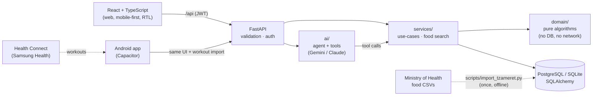

# FitFlow

[](https://github.com/OfriKeidar/FitFlow/actions/workflows/ci.yml)

### 🔗 [Live demo: fitflow-rgtr.onrender.com](https://fitflow-rgtr.onrender.com)
Log in with **`demo@fitflow.app`** / **`demo1234`** (a shared account with 5 weeks of data), or create your own.
*Free hosting: the first visit after a quiet period can take up to a minute while the server wakes up.*

**An adaptive nutrition & training coach.** Tell it what you ate in plain language, and it tracks
calories and macros, **learns your real metabolism from your own data**, and suggests meals from what
you have at home using an optimization algorithm.

A Hebrew, mobile-first web app. The design principle behind it: **deterministic algorithms at the core, AI at the edges.**
The LLM turns free text into calls to tested code. It never makes up a number.

<p align="center">
  
  
  
  
</p>
<p align="center">
  
  
  
  
</p>

## Highlights

| | What | How |
|---|---|---|
| 🧠 | **Adaptive TDEE**: learns how many calories *you* actually burn | Energy balance + least-squares slope of the weight trend, damped and capped; works with daily, weekly or monthly weigh-ins |
| 🍽️ | **"What should I eat?"** from what's at home, plus **"fit my meal"** amounts | **Integer Linear Programming** (PuLP/CBC): pantry limits, sensible-meal constraints, weighted macro deviation; **no-good cuts** for alternative suggestions |
| 💬 | **AI coach**: "I ate 2 eggs and ran for 30 minutes" | Tool-use agent with a hand-written loop; **proposes** entries, and the user **confirms** before anything is saved |
| 🔌 | **Any LLM**: Gemini (free), Claude, or any OpenAI-style API | Provider adapters; model fallback and a circuit breaker for free-tier quotas and overloads |
| 📈 | **Weight trend** without the daily water noise | Time-aware EWMA (alpha depends on the gap between weigh-ins) |
| 🎯 | **Target date**: "you'll reach 70 kg around Nov 26" | Pace as a % of body weight (safe for every body size); switches to maintenance at the target |
| 🥗 | **4,500+ Israeli foods** with household units ("1 cup", "1 slice") | The Ministry of Health's national nutrition database, imported by a script; relevance-ranked search so "egg" finds a fresh egg, not egg powder |
| 🔍 | **Insights** like "you eat 544 kcal more on weekends" | Statistics with minimum-data and minimum-effect thresholds, so it doesn't report noise |
| ⌚ | **Samsung Health sync** (Android app) | Capacitor wrapper + Health Connect; idempotent import keyed by workout id; watch-measured calories preferred |
| 🔐 | **Auth** | scrypt password hashing, stateless JWT, same error for unknown email and wrong password |

## Architecture



- **`domain/`** holds the algorithms as pure functions: energy targets, adaptive TDEE, the ILP optimizer, insights. Most of the tests live here.
- **`services/`** loads data, runs the domain logic and saves the results. `mappers.py` keeps SQLAlchemy out of the domain.
- **`ai/`** is the agent loop, the tool definitions and the prompt. Write tools only create *pending actions*.
- **`api/`** holds the FastAPI routes and Pydantic schemas. **`web.py`** serves the API and the built frontend from one origin.
- **`data/`** ships the food databases as JSON; `db/seed.py` loads them on first start and `db/migrate.py` upgrades existing databases in place.
- **`frontend/android/`** is the same web app wrapped as an Android app, which adds one thing the browser can't do: reading workouts from Health Connect.

Design decisions, trade-offs and the bugs found along the way are in **[docs/ARCHITECTURE.md](docs/ARCHITECTURE.md)**.

## Algorithms

| Algorithm | Where | What it does in the app |
|---|---|---|
| **Mifflin-St Jeor** BMR × activity factor | `domain/energy.py` | The first guess of daily calorie burn (TDEE), from sex, age, height and weight |
| **Energy-balance targets** | `domain/energy.py` | Daily calories = TDEE ± the gap for the weekly pace (7,700 kcal per kg). Protein by body weight, fat 25%, carbs the rest; a safety floor |
| **Time-aware EWMA** (exponential smoothing) | `domain/trend.py` | The weight trend line. `alpha = 1 - 0.9^days`, so a gap of several days between weigh-ins counts correctly |
| **Least-squares linear regression** | `domain/trend.py` | The rate of weight change (kg/day), used to learn the real TDEE. Chosen over the EWMA, which lags |
| **Damped adaptive update** (a learning rate + a cap) | `domain/trend.py` | TDEE moves halfway towards what the data says, at most 150 kcal per week, only with 14+ days and 70%+ days logged |
| **Integer Linear Programming** (PuLP / CBC solver) | `domain/optimizer.py` | "What should I eat?": integer servings from the pantry, binary "used" variables, max 4 foods, weighted over/under deviation from the meal's macro target |
| **No-good cuts** | `domain/optimizer.py` | "Another suggestion": a constraint that forbids the previous combination, then solve again |
| **Constrained fitting** (ILP with half-servings) | `domain/optimizer.py` | "Fit my meal": keep every food the user picked, and find amounts that match what's left today |
| **MET-based calorie estimate** (net MET) | `domain/activity.py` | Workout calories = (MET - 1) × weight × hours, so resting burn isn't counted twice |
| **Statistical insights with thresholds** | `domain/insights.py` | Weekend vs weekday intake, protein on training vs rest days; reported only with enough days and a big enough effect |
| **Streaks over calendar weeks** | `domain/insights.py`, `workout_stats.py` | Current and best streak of weeks that met the workout goal (the Israeli week, starting Sunday) |
| **Relevance ranking** | `services/food_search.py` | Sorting 4,500 foods by a tuple key: curated first, match quality, processed forms last, shorter names first |
| **Agentic tool-use loop** | `ai/agent.py` | The LLM calls search and "propose" tools in a loop; the code computes every number |
| **Circuit breaker + fallback** | `ai/providers.py` | After a 429/503 a model is skipped for a cooldown, and the next model on the list answers |
| **scrypt + HMAC-SHA256 (JWT)** | `services/auth.py` | Salted password hashing, signed tokens, constant-time comparison |

## Stack
**Backend:** Python 3.11, FastAPI, SQLAlchemy 2, PuLP, Gemini (OpenAI-compatible API) / Anthropic SDK, PyJWT, pytest (126 tests)
**Frontend:** React 19, TypeScript, Vite, Recharts, a PWA manifest, dark mode; **Android app** via Capacitor + Health Connect
**Ops:** Docker (multi-stage, non-root), docker-compose with PostgreSQL, GitHub Actions (tests on SQLite *and* PostgreSQL, lint, build, Docker smoke test), Render blueprint

## Run it

```bash
# Backend
python -m venv .venv
.venv/Scripts/pip install -e ".[dev]"
.venv/Scripts/python -m pytest                     # 126 tests
.venv/Scripts/python -m scripts.seed_demo           # optional: demo account with 5 weeks of data
.venv/Scripts/uvicorn fitflow.api.main:app          # API + interactive docs at http://localhost:8000/docs

# Frontend (second terminal)
cd frontend && npm install && npm run dev           # http://localhost:5173
```

The demo account is `demo@fitflow.app` / `demo1234`.

Or run the whole stack, including PostgreSQL, the way it runs in production:
```bash
docker compose up --build                           # http://localhost:8000
```

The AI coach needs a key in `.env` (copy `.env.example`). A **free Gemini key** from
[Google AI Studio](https://aistudio.google.com) is enough, and `ANTHROPIC_API_KEY` works too. Everything else works
without one, including all the tests (the agent is tested against scripted fake clients).

## Data
Food nutrition values: the Israeli national nutrition database (Tzameret), Israel Ministry of Health, via [data.gov.il](https://data.gov.il).
